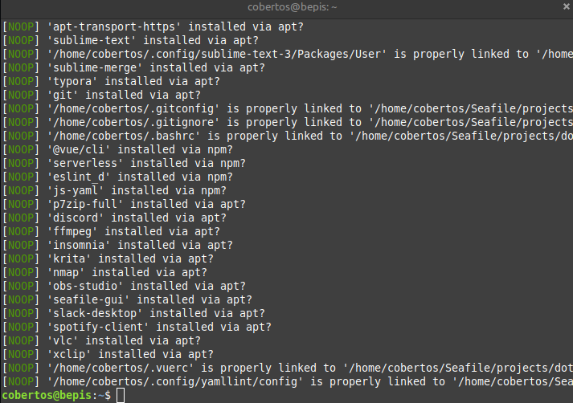

# Dot Files

My collection of dotfiles + a [bootstrapping](./bootstrap.py) script

* **Cross Platform** - Meant to work on Linux (Mint) _and_ Windows
* **Linking** - Symlinks over copying
* **Public** - Private keys and licenses are separate (for now... keeping an eye on git-crypt)
* **Automatic** - `python bootstrap.py` sets up everything. `--verify-only` only verifies, and is run every time I open a terminal
* **Multi-environment** - All configs have defaults, though special configs with suffix `##XXX` can be chosen with priority using `--environment=XXX` flag

<p align="center">
  
</p>

Supports:

<p align="justify">
  
  
  
</p>

as well as [asdf](https://github.com/asdf-vm/asdf), [Z](https://github.com/rupa/z), [flameshot](https://flameshot.org/), [Discord](https://discord.com), [ffmpeg](https://ffmpeg.org/), [Insomnia](https://insomnia.rest/), [Krita](https://krita.org/en/), [OBS](https://obsproject.com/), [Seafile](https://www.seafile.com/en/home/), and a ton more,,,

## Installation
### Linux Installation
```bash
cd ~
sudo apt update && sudo apt install git
git clone https://github.com/Cobertos/dotfiles.git
cd dotfiles
git submodule init
git submodule update # For ASDF and Z
python3 bootstrap.py # Make sure to use the right --environment=XXX
# https://github.com/danhper/asdf-python
# https://github.com/pyenv/pyenv/wiki/Common-build-problems
asdf plugin add python
sudo apt-get install -y build-essential libssl-dev zlib1g-dev libbz2-dev libreadline-dev libsqlite3-dev wget curl llvm libncurses5-dev libncursesw5-dev xz-utils tk-dev libffi-dev liblzma-dev python-openssl git
asdf install python latest:3.8
asdf global python 3.8.7
# https://github.com/asdf-vm/asdf-nodejs
asdf plugin add nodejs
bash -c '${ASDF_DATA_DIR:=$HOME/.asdf}/plugins/nodejs/bin/import-release-team-keyring'
asdf install nodejs lts
asdf global nodejs 14.15.4
pip install requests
python bootstrap.py # To get all node and python dependencies

# TODO: If you have no system python in your OS, you will probably want to get one
# or install asdf manually (source the correct file into your terminal first)
```

### Windows Native Installation using Git Bash

This no longer works, but should I go back to Windows I'll have to update. The steps to get this to work on Windows will be something like

* Find a replacement for asdf on Windows
  * The current code will work with plain old pyenv and nvm, so you could always install those manually first
* Fix all issues with \\ and / paths
* Find comparable packages in chocolatey, or use Ninite or something

The old installation:

* [Install chocolatey](https://chocolatey.org/docs/installation)
  * I would like to automate this but there's a lot of overhead with Python)
* `choco install ./packages.config`
* Install `pyenv` by downloading and extracting at the correct location and setting up variables
* Install Python 3.6+
* `python bootstrap.py`
  * Make sure to use the right `--environment=XXX`!
* You will need to manually install nvm for Windows for nodejs stuff

## Installation Part 2 (everything that I have yet to automate)
* Install Firefox
  * Login to Firefox
  * Disable DNS over HTTPS (or figure out a way to get hosts file working without it)
  * Setup the search engine aliases for `@google`, `@gh` switch to Startpage for default engine
  * Login to InoReader
  * Login to Mangools
  * Migrate any Tampermonkey scripts (or put them in here or something)
* Sublime
  * Install package control to recognize symlinked packages
  * Install license and license for FTP
  * Setup TabNine (TabNine::Config then paste key for TabNine Local)
* Spotify
  * Toggle download playlists
* Install Unity Hub
* Blender is installed separately (managing multiple Blender versions)
* Setup OBS to record into Seafile (save these prefs)
* Setup Unity defaults (External editor and stuff) (would be nice to capture these prefs)
* Hide excess folders in explorer/nemo, like Picture, Videos, etc
* Docker (removal of old and getting new)
* Migrate from old computer
  * Insomnia configs (all the sqlite databases in Insomnia's home directory)
  * .aws keys
  * .ssh keys
  * .npmrc keys
  * Any environment variables holding keys
  * Firefox/Chrome/wherever history
* Setup filesystem favorites

### Linux specific manually
* Configure Linux Mint Desktop
  * Change the theme to Dark (for Window borders, controls, and desktop)
  * Change wallpapers/backgrouns to the folder that has them all in it
  * Add a panel to every monitor, without grouped list applet merging and with window titles
  * Change the Linux Mint start menu icon
* Install NVIDIA and eGPU drivers and all the work that goes into that
  * `sudo apt install nvidia-driver-460`
  * Disable secure boot and thunderbolt security
  * Add the XOrg configuration, and double check the PCIe Bus IDs
  * Consider working on HotPlug support https://jpamills.wordpress.com/2017/03/18/hotplug-support-for-egpu-on-linux/

### Windows specific manually
* Windows settings
  * Lockscreen picture
  * Uninstall unwanted default apps
  * Connect phone to My Phone
  * Login to other Microsoft related products (Office)
  * Install office
  * Set surface pen pressure to like 8-9?
  * Configure taskbar preferences (non grouping etc)
  * Remove certain pins from the taskbar
  * Make backspace faster/proper speed
  * Remove OneDrive
  * Rename computer
  * Install Windows App Store apps (including Paint.NET and Spotify)

## Future Support
* Voicemeeter Banana (Linux / Ubuntu equivalent?)
* Setup correct file associations (for .xml, .html, etc...)
* VLC Plugins
* Audacity and configurations
* Make sure that Chrome/Firefox syncs settings for refined GitHub (looks like it worked)
* /etc/hosts and C:\Windows\System32\drivers\etc\hosts or wherever it is in Windows
* Seafile notifications disabling?
* Configure keybindings (like for flameshot)
* Add a little indicator to PS1 when dotfiles is out of date
* Make `findcode` better/nicer. Can we have some sort of indexing search?

### Won't Support
* Pulling in z's config, as it should honeslty be separate per-machine, due to file path differences, and it can contain things I don't want public

## Windows TODOs
* Re-evaluate if ConEmu needs to be used at all
* Installing chocolatey packages
* A separate packages.config for different workflows
* Readd all the windows registry, theme stuff, and paint.NET
  * The ansible branch had some extras for screen rotation disable and removing Python execution aliases on Windows
  * The ansible branch also solves choco git install flags better, and by default asks for WSL to be installed (which IMO is smarter)
* Windows PowerTools?
* Consider removing WavesMaxxAudio to stop popup and background processing
  * https://github.com/GrzegorzKozub/xps
  * https://github.com/kevinshroff/KSMRD-Modded-Realtek-Audio-Drivers
* Consider applying filter keys faster repeats fix
  * https://superuser.com/questions/1058474/increase-keyboard-repeat-rate-beyond-control-panel-limits-in-windows-10
  * This seems to be a Windows 10/Dell Latitude issue. I dont have this issue on this computer in Linux Mint...
* Disable Intel AMT