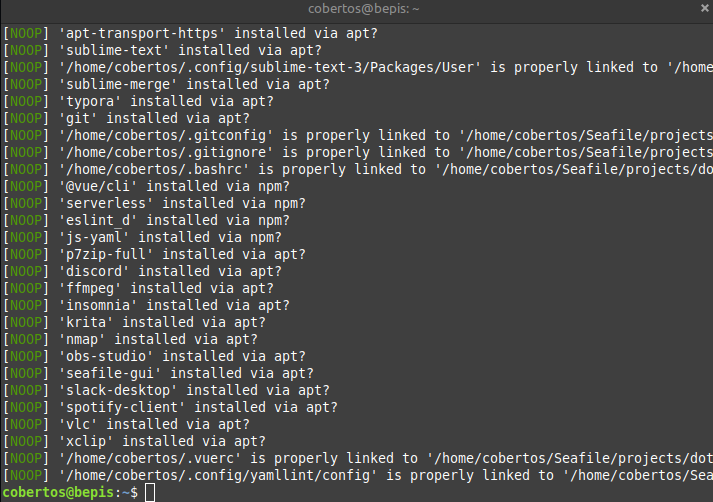

# Dot Files

My collection of dotfiles + a [bootstrapping](./bootstrap.py) script

* **Linking** - Symlinks over copying
* **Public** - Private keys and licenses are separate. TODO: Putting in a separate local-only repository would be nice
* **Automatic** - `python bootstrap.py` sets up everything. `--verify-only` only verifies, and is run every time I open a terminal
* **Multi-environment** - All configs have defaults, though special configs with suffix `##XXX` can be chosen with priority using `--environment=XXX` flag

<p align="center">
  
</p>

Supports:

<p align="justify">
  
  
</p>

as well as [asdf](https://github.com/asdf-vm/asdf), [flameshot](https://flameshot.org/), [Discord](https://discord.com), [ffmpeg](https://ffmpeg.org/), [Insomnia](https://insomnia.rest/), [Krita](https://krita.org/en/), [OBS](https://obsproject.com/), [Seafile](https://www.seafile.com/en/home/), [Promnesia](https://github.com/karlicoss/promnesia), and a ton more,,,

## Installation
### Linux Installation
```bash
cd ~
sudo apt update && sudo apt install git
git clone https://github.com/Cobertos/dotfiles.git
cd dotfiles
git submodule init
git submodule update # For ASDF
python3 bootstrap.py # Make sure to use the right --environment=XXX
# https://github.com/danhper/asdf-python
# https://github.com/pyenv/pyenv/wiki/Common-build-problems
asdf plugin add python
sudo apt-get install -y build-essential libssl-dev zlib1g-dev libbz2-dev libreadline-dev libsqlite3-dev wget curl llvm libncurses5-dev libncursesw5-dev xz-utils tk-dev libffi-dev liblzma-dev python-openssl git
asdf install python latest:3.8
asdf global python 3.8.7
# https://github.com/asdf-vm/asdf-nodejs
asdf plugin add nodejs
bash -c '${ASDF_DATA_DIR:=$HOME/.asdf}/plugins/nodejs/bin/import-release-team-keyring'
asdf install nodejs lts
asdf global nodejs 14.15.4
pip install requests
python bootstrap.py # To get all node and python dependencies

# TODO: If you have no system python in your OS, you will probably want to get one
# or install asdf manually (source the correct file into your terminal first)
```

## Installation Part 2 (everything that I have yet to automate)
* Install Firefox
  * Login to Firefox
  * Disable DNS over HTTPS (or figure out a way to get hosts file working without it)
  * Setup the search engine aliases for `@google`, `@gh` switch to Startpage for default engine
  * Login to InoReader
  * Login to Mangools
  * Migrate any Tampermonkey scripts (or put them in here or something)
* Sublime
  * Install package control to recognize symlinked packages
  * Install license and license for FTP
  * Setup TabNine (TabNine::Config then paste key for TabNine Local)
* Spotify
  * Toggle download playlists
* Install Unity Hub
* Blender is installed separately (managing multiple Blender versions)
* Setup OBS to record into Seafile (save these prefs)
* Setup Unity defaults (External editor and stuff) (would be nice to capture these prefs)
* Hide excess folders in explorer/nemo, like Picture, Videos, etc
* Docker (removal of old and getting new)
* Migrate from old computer
  * Insomnia configs (all the sqlite databases in Insomnia's home directory)
  * .aws keys
  * .ssh keys
  * .npmrc keys
  * Any environment variables holding keys
  * Firefox/Chrome/wherever history
* Setup filesystem favorites

### Linux specific manually
* Configure Linux Mint Desktop
  * Change the theme to Dark (for Window borders, controls, and desktop)
  * Change wallpapers/backgrouns to the folder that has them all in it
  * Add a panel to every monitor, without grouped list applet merging and with window titles
  * Change the Linux Mint start menu icon

## Future Support
* Voicemeeter Banana (Linux / Ubuntu equivalent?)
* Setup correct file associations (for .xml, .html, etc...)
* VLC Plugins
* Audacity and configurations
* Make sure that Chrome/Firefox syncs settings for refined GitHub (looks like it worked)
* /etc/hosts and C:\Windows\System32\drivers\etc\hosts or wherever it is in Windows
* Seafile notifications disabling?
* Configure keybindings (like for flameshot)
* Add a little indicator to PS1 when dotfiles is out of date
* Make `findcode` better/nicer. Can we have some sort of indexing search?
* Put Userscripts for Tampermonkey in here (or maybe submodule? would be nice to use their WebDAV interface)
* Switch pip over to use the --user flag, or make it an option? Not sure what pipx needs?
